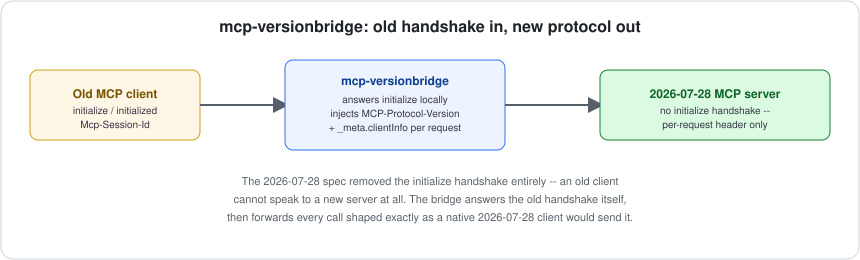

# mcp-versionbridge

[](https://github.com/jayblast-spec/mcp-versionbridge/actions/workflows/ci.yml)
[](https://www.npmjs.com/package/mcp-versionbridge)
[](./LICENSE)
[](https://mcp-versionbridge.vercel.app)



**Lets an MCP client stuck on the pre-2026-07-28 `initialize` handshake talk to a 2026-07-28 MCP server, with no changes to either side.**

## The gap this fills

The [2026-07-28 MCP specification](https://blog.modelcontextprotocol.io/posts/2026-07-28/) removed the `initialize`/`initialized` handshake entirely, along with the `Mcp-Session-Id` header it used. Every prior spec version (2024-11-05, 2025-03-26, 2025-06-18) negotiates one protocol version for an entire session via that handshake. Under 2026-07-28, there is no handshake — every request carries its own `MCP-Protocol-Version` HTTP header, and client identity travels per-request in `params._meta["io.modelcontextprotocol/clientInfo"]` instead of being negotiated once.

This is a clean break, not a superset: **a client written against 2026-07-28 cannot talk to a pre-2026-07-28 server at all, and a client that only knows the old handshake cannot talk to a 2026-07-28 server**, because that server never implements `initialize` in the first place. As the ecosystem migrates unevenly, that's a real, immediate interoperability wall. A few projects have started patching this inside their own codebases as one-off fixes; there wasn't an independent, reusable bridge.

## What it does (v1 scope)

mcp-versionbridge runs as a small HTTP proxy that looks like an old-style MCP server to an old-style client, and talks to a real 2026-07-28 server behind it:

```
[old client, 2025-06-18 handshake]  <--http-->  [mcp-versionbridge]  <--http-->  [2026-07-28 server]
```

1. The old client sends `initialize` as it always has. The bridge answers it **locally** — it is never forwarded, since the new server doesn't implement that method — capturing the client's requested protocol version, capabilities, and `clientInfo`, and issuing an `Mcp-Session-Id` the old client will echo back.
2. Every subsequent request from that client is forwarded to the real server with `MCP-Protocol-Version` set and `params._meta["io.modelcontextprotocol/clientInfo"]` injected (merged with, not overwriting, any `_meta` the client already sent) — exactly what a native 2026-07-28 client would send.
3. Responses are relayed back unchanged.

**Directionality:** v1 only bridges *old client → new server*. The reverse (a 2026-07-28-native client reaching an old server) is a real, distinct need but isn't implemented here yet — tracked as a v1.1 direction, not silently half-supported.

**Transport:** HTTP only, since the per-request `MCP-Protocol-Version` mechanism the 2026-07-28 spec documents is HTTP-header-based. stdio transport is out of scope for v1.

**Capabilities:** the bridge passes through whatever capabilities the old client declared at `initialize` time rather than querying the new server's actual capabilities via `server/discover` — that RPC's exact request/response schema isn't in the public spec write-up yet, and guessing at it would make this tool look more authoritative than it is. Pass-through is honest and functional; discovery-based negotiation is a natural, clearly-scoped follow-up once that schema is documented.

## Install

```bash
npm install mcp-versionbridge
```

## Usage

```ts
import { startVersionBridge } from "mcp-versionbridge";

const bridge = await startVersionBridge({
  newServerUrl: "https://my-2026-07-28-server.example.com/mcp",
});

console.log(`Point your old MCP client at ${bridge.url} instead of the real server.`);

// later
await bridge.stop();
```

Run the annotated demo (a fixture 2026-07-28 server + a real old-style handshake, showing exactly what crosses the wire):

```bash
npx tsx examples/demo.ts
```

## Non-goals (v1)

- New-client → old-server direction (planned, not yet implemented).
- stdio transport.
- `server/discover`-based capability negotiation (schema not yet public).
- Authentication/authorization pass-through beyond whatever headers you add yourself — this bridges protocol-version mechanics, not auth.

## Development

```bash
npm install
npm run typecheck
npm test
npm run build
```

## License

MIT
